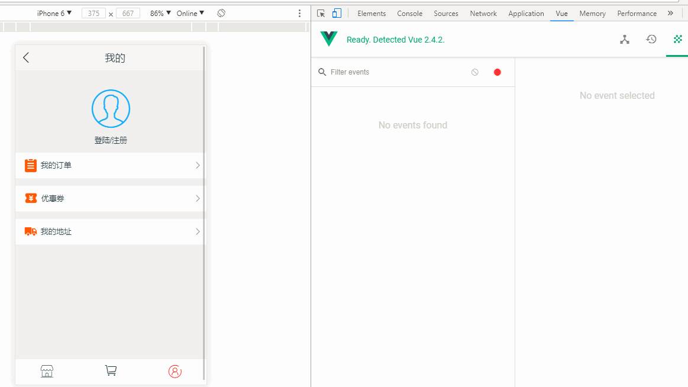
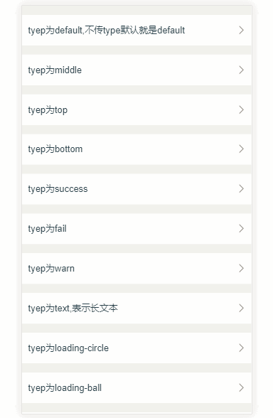

# vue2-dialog
> A mobile Vue plugin for Dialog

> pluginName:  vue2-dialog

> version: 1.0.1

> author:	Alan Chen

> github:	alanchenchen@github.com

> date:	2017/12/13

#### 此插件只适配了移动端，有问题请直接提issue.

## 插件能做什么
* 你可以用插件来做`Alert`,`Confirm`,`ActionSheet(类似微信的上拉通知栏)`,`Toast`等弹窗组件，也可以适用插件内置的`AddressPicker(地址三级联动选择器)`,`Loading(全屏loading动画)` and `Scroller(集成上拉加载，下拉刷新和嵌到滚动多种功能)`



## 使用方法
* 通过NPM下载安装插件
```node
npm install vue2-dialog --save
```

#### 1.在vue单文件里使用(vue-cli)
* 通过import或者require 导入插件,手动调用Vue.use() ,全局调用(直接加载所有的组件)

``` javascript 
import {VueDialog} from 'vue2-dialog'
Vue.use(VueDialog)
```

* 通过import或者require 导入插件,手动调用Vue.use() ,按需加载(只会加载你需要的组件)

``` javascript 
import {Scroller,Alert,Confirm} from 'vue2-dialog'
Vue.component(Scroller.name,Scroller)
Vue.component(Alert.name,Alert)
Vue.component(Confirm.name,Confirm)
```

#### 2.在script标签里使用
* 直接在script标签里通过src引入，但你必须先引入vuejs的script  

``` html 
<script src="dist/vue2-dialog.js"></script>
```

* 直接在vue单文件组件里使用或者在html里使用组件

``` html 
<Alert />
<Confirm />
<Toast />
<Scroller />
...
```

## 选项
### 1. Alert
#### props
 *alert* `[Object]`

| key         |            value                         |description|
|:-----------:|:----------------------------------------:|:------:|
| title       | `[String]` or `[HTML Tag]`   |   Alert里显示的标题   |
| content     | `[String]` or `[HTML Tag]`|   Alert里显示的内容    |
| alertBtn    | `[String]`|   Alert里确认按钮的文字    |
| isShow      | `[Boolean]`|  是否显示Alert,必须传入,而且为false,在需要显示的时候让其为true即可  |

*closeOnClickModal* `[Boolean]`

| prop name  |      description                         |required| default |
|:-----------:|:----------------------------------------:|:------:|:-------:|
| `closeOnClickModal` | `[Boolean]`是否通过点击遮罩层来关闭Alert  |   No   |  false  |

#### emit events
* `ok ` 点击Alert的确认按钮自定义事件，Alert框会自动关闭. 

#### DEMO 代码
```javascript
//template
<Alert :alert="alert" :closeOnClickModal="true" @ok="ok" />

//script
export default {
	data(){
		return{
			alert:{
				title:'tip',
				content:'Hello World!'
				alertBtn:'开森',
				isShow:false
			}
		}
	},
	methods:{
		ok(){
			console.log('我点击确认了n~')
		}
	}
}
```

### 2. Confirm
#### props
 *confirm* `[Object]`

| key         |            value                         |description|
|:-----------:|:----------------------------------------:|:------:|
| title       | `[String]` or `[HTML Tag]`   |   Confirm里的标题   |
| content     | `[String]` or `[HTML Tag]`|  Confirm里的内容    |
| cancelBtn    | `[String]`|   Confirm里取消按钮的文字    |
| confirmBtn    | `[String]`|   Confirm里确认按钮的文字    |
| isShow      | `[Boolean]`|  是否显示Confirm,必须传入,而且为false,在需要显示的时候让其为true即可 |

*closeOnClickModal* `[Boolean]`

| prop name  |      description                         |required| default |
|:-----------:|:----------------------------------------:|:------:|:-------:|
| `closeOnClickModal` | `[Boolean]`是否通过点击遮罩层来关闭Confirm |   No   |  false  |

#### emit events
* `ok ` 点击Confirm的确认按钮自定义事件，Confirm框会自动关闭.  
* `cancel ` 点击Confirm的取消按钮自定义事件，Confirm框会自动关闭. 

#### DEMO 代码
```javascript
//template
<Confirm :confirm="confirm" :closeOnClickModal="true" @ok="ok" @cancel="cancel" />

//script
export default {
	data(){
		return{
			confirm:{
				title:'tip',
				content:'确定要关闭浏览器嘛?'
				confirmBtn:'确定',
				cancelBtn:"取消"
				isShow:false
			}
		}
	},
	methods:{
		ok(){
			console.log('我关闭了~')
		},
		cancel(){
			console.log('我取消了~')
		}
	}
}
```

### 3. Toast



#### props
 *toast* `[Object]`

| key         |            value                         |description| required | default |
|:-----------:|:----------------------------------------:|:---------:|:--------:|:-------:|
| time       | `[Number]`  |控制Toast显示的时间 | No | 500 |
| type     | `[String]`| Toast显示的类型,有12种类型(见type) | No | default |
| content    | `[String]` or `[HTML Tag]`|  Toast显示的内容    | Yes | / |
| isShow      | `[Boolean]`|   是否显示Toast  | Yes | / |

`type`

| type name |           description                       |
|:---------:|:-----------------------------------------:|
|    top    | 从顶部滑入 |
|    bottom | 从底部滑入 |
|    default    | 显示在窗体的30%位置 |
|    middle    | 显示在窗体的50%位置 |
|    succes    | 伴有成功样式图标 |
|    fail    | 伴有失败样式图标 |
|    warn    | 伴有警告样式图标 |
|    text    | 显示长文本专用 |
|    loading-circle    | 显示圆圈样式的loading |
|    loading-ball    | 显示小球环绕样式的loading |
|    loading-wave    | 显示波纹样式的loading |
|    mini-loading    | 显示mini样式的loading，loading在左侧，文字在右侧 |

#### DEMO 代码
```javascript
//template
<Toast :toast="toast" />

//script
export default {
	data(){
		return{
			toast:{
				isShow:false,
				time:2000,
				content:'正在加载数据...',
				type:'mini-loading'
			}
		}
	}
}
```

### 4. ActionSheet
#### props
 *actionSheet* `[Object]`

| key         |            value                         |description|
|:-----------:|:----------------------------------------:|:------:|
| menu       | `[Array - Object]` |  ActionSheet里的菜单项   |
| isShow      | `[Boolean]`|   是否显示ActionSheet  |

> menu内的菜单项必须是Object，必须要有label和content两个键名，比如`[label:'del',content:'delete the data']`

*cancelMode* `[Boolean]`

| prop name  |      description                         |required| default |
|:-----------:|:----------------------------------------:|:------:|:-------:|
| `cancelMode` | `[Boolean]`是否显示取消的菜单项   |   No   |  false  |

*closeOnClickModal* `[Boolean]`

| prop name  |      description                         |required| default |
|:-----------:|:----------------------------------------:|:------:|:-------:|
| `closeOnClickModal` | `[Boolean]`是否通过点击遮罩层来关闭ActionSheet  |   No   |  false  |


#### emit events
* `cancel ` 点击取消菜单项的自定义事件 (必须保证cancelMode为true).
* 其余自定义事件取决于menu的label的值，例如：
```javascript
 actionSheet:{
	isShow:false,
	menu:[
		{label:'title',content:`<span style=color:blue>确定咩？</span><br /><span style=color:#bbb;font-size:12px>删除后就没了...</span>`},
		{label:'remain',content:'我要保留'},
		{label:'del',content:`<p style=color:red>不了，删除`}
	]
	/*
	 * ActionSheet有 2个自定义事件： 'remain' and 'del'。请注意! title不会返回自定义事件，因为title项不可点击！
	 */
}
```


#### DEMO 代码
```javascript
//template
	<ActionSheet 
		:actionSheet="actionSheet" 
		:cancelMode="cancelMode" 
		@del="del"
		@remain="remain"
		@cancel="cancel"
	/>

//script
export default {
	data(){
		return{
			actionSheet:{
				isShow:false,
				menu:[
					{label:'title',content:`<span style=color:blue>确定咩？</span><br /><span style=color:#bbb;font-size:12px>删除后就没了...</span>`},
					{label:'remain',content:'我要保留'},
					{label:'del',content:`<p style=color:red>不了，删除`}
				]
			}	
		}
	},
	methods:{
		del(){
			console.log('我要删除~')
		},
		remain(){
			console.log('不，我要保留~')
		},
		cancel(){
			console.log('我取消了~')
		}
	}
}
```

### 5. Loading
#### props
| prop name  |      description                         |required| default |
|:-----------:|:----------------------------------------:|:------:|:-------:|
| `loading` | `[Boolean]`是否开启 Loading   |   Yes   |  /  |

#### DEMO 代码
```javascript
//template
	<Loading :loading="loading" />

//script
export default {
	data(){
		return{
			loading:false
		}
	},
	created(){
		this.loading = true;
		//请求数据
		this.$http.post('test/productDetail',{}).then(
			res => {
				//如果数据加载完毕，就让loading消失
				...
				this.loading = false
			}
		).catch(
			err =>console.log(err)
		)
	}
}
```

### 6. AddressPicker
#### props
| prop name  |      description                         |required| default |
|:-----------:|:----------------------------------------:|:------:|:-------:|
| `addressShow` | `[Boolean]`是否显示AddressPicker   |   Yes   |  /  |

*closeOnClickModal* `[Boolean]`

| prop name  |      description                         |required| default |
|:-----------:|:----------------------------------------:|:------:|:-------:|
| `closeOnClickModal` | `[Boolean]`是否通过点击遮罩层来关闭AddressPicker  |   No   |  false  |

#### emit events
* `ok ` 点击确认按钮的自定义事件，AddressPicker会返回用户当前选择的省市区信息，在自定义事件里传参即可获取
* `cancel ` 点击取消按钮的自定义事件，AddressPicker会自动关闭


#### DEMO 代码
```javascript
//template
	<AddressPicker 
		:addressShow="addressShow" 
		@ok="ok" 
		@cancel="addressShow=false" 
	/>

//script
export default {
	data(){
		return{
			addressShow:false
		}
	},
	methods:{
		ok(cont){
			this.addressShow = false
			alert(`You choose ${cont.province}-${cont.city}-${cont.town || ''})
		},
	}
}
```
> 请注意: 如果用户当前选中的没有town也就是第三级信息，组件不会返回town的值，只会返回{province:'天津市',city:'河西区'}

**请前往[AddressPicker](https://github.com/alanchenchen/vue-address-picker) 查看详细用法.**

### 7. Scroller

**请前往[v-scroller](https://github.com/alanchenchen/v-scroller) 查看详细用法.**
